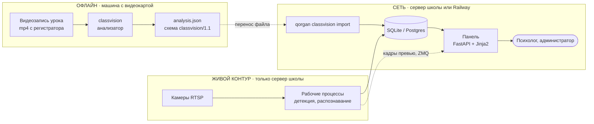
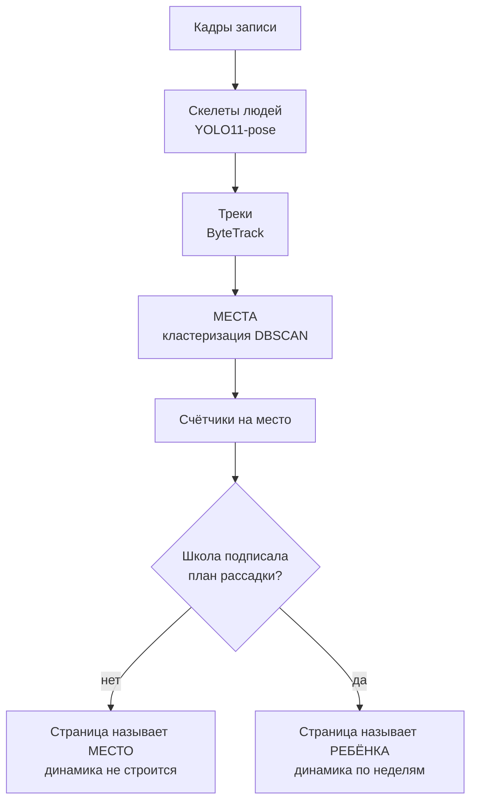

# Архитектура Qorgan AI

Документ для того, кто будет развивать проект дальше. Он объясняет **как устроены обе
системы, что куда идёт и почему сделано именно так** — на уровне решений, а не строк кода.
Читать его можно, не открывая исходники.

Подробности вынесены в отдельные файлы:

| Файл | О чём |
|---|---|
| [`docs-architecture/01-analyser.md`](docs-architecture/01-analyser.md) | Анализатор записей: от кадра до отчёта |
| [`docs-architecture/02-platform.md`](docs-architecture/02-platform.md) | Панель: слои, права, база данных |
| [`docs-architecture/03-contract.md`](docs-architecture/03-contract.md) | Контракт между системами и импорт |
| [`docs-architecture/04-decisions.md`](docs-architecture/04-decisions.md) | Решения, которые нельзя «упростить» |
| [`docs-architecture/05-extending.md`](docs-architecture/05-extending.md) | Как добавить страницу, метрику, право |

---

## 1. Две системы, а не одна



**Разделение между `classvision` и `qorgan` — не вкусовое, оно делает юридическую работу.**
Анализатор построен на Ultralytics (YOLO11-pose) под лицензией **AGPL-3.0**. Сетевая
оговорка AGPL означает: если сетевой сервис является производным произведением от AGPL-кода,
его исходники должны быть открыты пользователям сервиса. Панель, которая крутила бы модель
внутри себя, была бы именно этим. Поэтому:

* анализатор — **отдельный процесс**, который пишет файл и завершается;
* панель **никогда не импортирует** ни torch, ни ultralytics, ни OpenCV;
* между ними — **один JSON-файл**, а не общая библиотека и не вызов по сети.

Это записано в `classvision/THIRD_PARTY_LICENSES.md` и `classvision/INTEGRATION.md` §1, и
проверяется тестом. **Это разделение нельзя «упростить» позже** — оно и есть условие
поставки школе.

Второе следствие того же разделения: анализ идёт **не в реальном времени**. Это осознанно —
модель на 1280 пикселей даёт 0,109 с на кадр, то есть час записи разбирается порядка часа.
Живой контур (буллинг, оружие, столовая) — отдельные рабочие процессы с другими моделями.

---

## 2. Что делает каждая система

### `classvision` — анализатор записей уроков

Вход: файл `mp4` с регистратора. Выход: `analysis.json` плюс, по желанию, статичный
HTML-отчёт, который открывается из папки без сервера.

Считает **по местам в классе**, а не по детям: сколько раз с каждого места поднимали руку,
вставали, уходили, клали голову на парту, отворачивались назад; сколько времени место было
видно; как менялся показатель активности внутри урока и между уроками. Отдельно —
поведение взрослого: у доски, за столом, среди учеников, вне кадра.

Подробно: [`docs-architecture/01-analyser.md`](docs-architecture/01-analyser.md).

### `qorgan-ai-main` — платформа

Веб-панель школы плюс командная строка к той же базе. Показывает: живую стену камер,
события буллинга, тревоги об оружии, журнал столовой, реестр учеников, кабинет психолога и
**разбор уроков** — то, что импортировано из анализатора.

Подробно: [`docs-architecture/02-platform.md`](docs-architecture/02-platform.md).

---

## 3. Единица учёта: МЕСТО, а не ребёнок

Это главное архитектурное решение всего проекта, и от него зависит почти всё остальное.

**Распознавание лиц в классе было измерено и не работает.** На 250 клипах из холла школы —
14 970 лиц, медианный размер 11,5 пикселя в рабочем разрешении 1280×720, узнано **ноль**.
В классе камера чаще всего смотрит ученикам в затылок. Поэтому имя ребёнка **не может**
браться из видео.

Что вместо этого:



**Трек умирает при первом же длительном перекрытии, место — нет.** Место существует между
уроками: оно найдено по геометрии и сопоставляется от записи к записи. Именно поэтому
накопление за неделю возможно, хотя трекер теряет человека десятки раз за урок.

Имя появляется **только** через `qorgan classvision attest` — команду, которая требует
указать, **кто** подписал и **на основании какого документа**. Ни лицо, ни трекер имени не
создают. Это не ограничение реализации, а обещание, данное школе письменно
(`qorgan-ai-main/docs/questions-for-school.md` §10).

---

## 4. Что система принципиально не делает

Это тоже часть архитектуры: перечисленное ниже не «пока не реализовано», а **не должно
появиться**, и код устроен так, чтобы этого не случилось незаметно.

* **Не ставит диагнозов и не даёт рекомендаций.** Есть тест, который читает исходники
  пакета кабинета и падает на словах «рекоменд», «риск», «тревожн», «подозритель».
* **Не сравнивает детей между собой.** Динамика — это сравнение ребёнка **с самим собой**:
  медиана его же предыдущих уроков и MAD как мера разброса.
* **Не измеряет вовлечённость, внимание, мотивацию и настроение.** Камера этого не видит.
  Все счётчики — это **поза** и **положение**, и ни один ярлык нельзя заменить на слово из
  предыдущего предложения.
* **Не направляет ребёнка к психологу сама.** Кнопку «Передать психологу» нажимает человек,
  и его имя сохраняется рядом с записью.
* **Ноль и «не измерялось» никогда не выглядят одинаково.** Там, где измерения не было,
  страница пишет «не измерялось» курсивом с пунктиром, а не ноль. Это самое нагруженное
  правило в оформлении, и оно существует потому, что однажды они рисовались одинаково.

---

## 5. Где что лежит

```
school-computervision/
├── Dockerfile              ← образ панели, контекст сборки = этот корень
├── railway.json            ← сборка и health-check для Railway
├── .dockerignore           ← не пускает в образ данные детей и classvision/
│
├── qorgan-ai-main/         ← ПЛАТФОРМА
│   ├── src/qorgan/
│   │   ├── web/            ← маршруты, шаблоны, стили
│   │   ├── db/models/      ← таблицы
│   │   ├── classvision/    ← импорт и страницы разбора уроков
│   │   ├── psychologist/   ← кабинет
│   │   ├── capture/ detection/ events/ faces/ identity/  ← живой контур
│   │   ├── supervisor/ worker/ preview/  ← рабочие процессы
│   │   ├── roles.py        ← права, единственный источник правды
│   │   └── settings.py     ← конфигурация, единственный источник секретов
│   ├── migrations/         ← alembic
│   ├── config/             ← описания камер (YAML), без секретов
│   ├── deploy/             ← точка входа контейнера, список зависимостей
│   └── docs/               ← вопросы школе, спецификации, аудиты
│
├── classvision/            ← АНАЛИЗАТОР (офлайн, видеокарта)
│   ├── src/classvision/
│   │   ├── vision/ video/  ← модель и декодирование
│   │   ├── room/           ← места, зоны, перспектива
│   │   ├── metrics/        ← активность, учитель, тренды
│   │   ├── report/         ← артефакт, HTML, записка модели
│   │   └── cabinet/        ← статичная выгрузка кабинета
│   ├── INTEGRATION.md      ← контракт с панелью
│   ├── MEASUREMENTS.md     ← что и как измерено
│   └── THIRD_PARTY_LICENSES.md  ← блокеры поставки
│
└── docs-architecture/      ← этот набор документов
```

---

## 6. Что где выполняется

| Компонент | Где работает | Нужна видеокарта | Есть в контейнере Railway |
|---|---|---|---|
| Панель (FastAPI) | Сервер школы или Railway | нет | **да** |
| Командная строка `qorgan` | Там же | нет | **да** |
| Импорт разборов | Там же | нет | **да** |
| Рабочие процессы (RTSP, детекция) | Только сервер школы | да | нет |
| Анализатор `classvision` | Отдельная машина, офлайн | да | нет |

На Railway разворачивается **только панель**. Камер и видеокарты там нет — страницы
показывают это честно: камеры «офлайн», списки событий пустые с объяснением. Разбор уроков
при этом работает полностью, потому что он и так делается заранее.

Развёртывание: [`qorgan-ai-main/DEPLOY-RAILWAY.md`](qorgan-ai-main/DEPLOY-RAILWAY.md).
