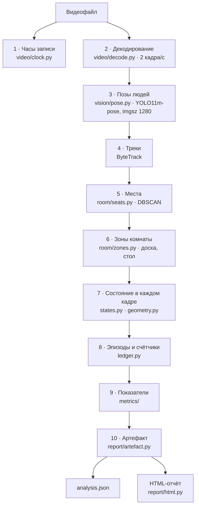

# Анализатор `classvision`: от кадра до отчёта

Отдельная программа. Запускается на машине с видеокартой, **офлайн**, читает файл `mp4` и
пишет файл `json`. Панели не знает и никогда её не импортирует.

```bash
classvision analyse D14_20260815101759.mp4 --config configs/camera_d14.yaml
classvision analyse-session part1.mp4 part2.mp4    # один урок, разрезанный регистратором
```

---

## 1. Конвейер целиком



---

## 2. Что делает каждый этап

### 1. Часы записи — `video/clock.py`

Регистратор впечатывает время прямо в кадр. Модуль читает его из пикселей и сверяет с
именем файла. Порядок источников: **наложение в кадре → имя файла → указано вручную →
неизвестно**, и выбранный источник записывается в артефакт (`clock_source`), потому что
«время из имени файла» и «время, прочитанное с картинки» — разные по надёжности вещи.

Зачем: без даты урок нельзя поставить в недельный ряд, а неверная дата хуже отсутствующей.

### 2. Декодирование — `video/decode.py`

Кадры берутся не все, а с шагом **2 кадра в секунду**. Этого достаточно: поднятая рука
держится секундами, а не кадрами. Час записи — около 7 000 кадров вместо 90 000.

### 3. Позы — `vision/pose.py`

YOLO11m-pose на разрешении 1280. Даёт 17 точек скелета (формат COCO) на каждого найденного
человека. Измерено: 0,109 с на кадр на Apple MPS.

**Почему поза, а не «детекция человека».** По рамке нельзя отличить поднятую руку от
почёсанного затылка, а по точкам плеч, локтей и запястий — можно.

### 4. Треки — ByteTrack

Сопоставляет людей между соседними кадрами. **Трек живёт недолго**: при длительном
перекрытии он рвётся и человек получает новый номер. Это ограничение принято, а не
преодолено — см. следующий этап.

### 5. Места — `room/seats.py`

Ключевой этап. Точки людей за весь урок кластеризуются алгоритмом **DBSCAN** в пространстве,
выправленном по перспективе (`room/perspective.py`): дальняя парта в кадре меньше ближней,
и без выправления один ряд склеивается с другим.

Что здесь важно:

* пороги подбираются перебором (`EPS_SWEEP` от 0,20 до 0,75) и выбирается тот, при котором
  число мест **совпадает с числом людей**, найденным детектором;
* места, занятые меньше **25 %** времени урока (`MIN_OCCUPANCY`), отбрасываются — это
  проходящие мимо, а не сидящие;
* перед кластеризацией точки прореживаются (`DISCOVERY_THIN_SECONDS = 5 с`), иначе
  соседние места сливаются в одно.

**Результат: место — устойчивая единица, которая переживает потерю трека и существует между
уроками.** Именно на неё вешаются все счётчики.

### 6. Зоны комнаты — `room/zones.py`

Доска и стол учителя задаются в конфигурации камеры (`configs/camera_*.yaml`) как
многоугольники. Проверяются **по линии плеч**, а не по низу рамки: измерено, что у доски и
за партой низ рамки отличается на 2 пикселя, а линия плеч — на 200.

Если зона доски не задана — состояние «у доски» **не может возникнуть ни в одном кадре**, и
счётчик выдаётся как «не измерялось», а не как ноль.

### 7. Состояние в кадре — `states.py`, `geometry.py`

Для каждого места в каждом кадре определяется одно из восьми состояний:

| Состояние | Что значит |
|---|---|
| `seated` | сидит на месте, лицом вперёд |
| `hand_raised` | поднял руку |
| `stood_up` | встал на своём месте |
| `away_from_place` | вне своего места |
| `at_board` | у доски |
| `head_down` | голова опущена / лежит на парте |
| `turned_away` | смотрит назад |
| `unknown` | человек виден, но поза не читается |

**Все геометрические пороги нормированы на ширину плеч.** Иначе ближний ряд и дальний
измерялись бы разными линейками. Пороги не выдуманы, а измерены на реальных записях и
записаны в `MEASUREMENTS.md` — например, «рука выше плеча» это 0,45 ширины плеч, что взято
из 99-го процентиля реальных значений.

Ключевые константы: `STRICT_CONF = 0.50` и `LOOSE_CONF = 0.30` — уверенность модели в точке
скелета; `MIN_USABLE_SHOULDER_PX = 8.0` — ниже этого размера поза не читается вообще.

> **Здесь был найден и исправлен показательный дефект.** Сначала «рука поднята» считалась
> относительно головы. Когда человек опускал голову, отсчёт переворачивался, и учитель,
> склонившийся над столом, попадал в статистику как поднявший руку 35 раз из 45. Опорной
> линией стала линия плеч.

### 8. Эпизоды и счётчики — `ledger.py`

Отдельные кадры склеиваются в **эпизоды**: непрерывные отрезки одного состояния. Короткие
включения отбрасываются по порогу — иначе дрожание модели давало бы сотни «поднятий руки»
в минуту.

**Отброшенные короткие эпизоды не теряются, а записываются** (`discarded_short_runs`),
чтобы страница могла отличить «этого не было» от «было, но короче порога» и написать это
словами.

### 9. Показатели — `metrics/`

| Модуль | Что считает |
|---|---|
| `activity.py` | Показатель активности места за урок: взвешенная сумма наблюдаемых признаков |
| `within_lesson.py` | Как показатель менялся **внутри** урока: отрезки плюс тест Манна-Кендалла |
| `trend.py` | Сравнение урока с собственной нормой места: медиана прошлых уроков и MAD |
| `teacher.py` | Взрослый: у доски, за столом, среди учеников, вне кадра, движется |

**Показатель активности — это не «вовлечённость».** Он складывается из четырёх измеряемых
слагаемых (голова поднята, не отвернулся, на своём месте, видимые действия), и на странице
каждое слагаемое показано отдельно вместе с его весом — чтобы число можно было разобрать, а
не принять на веру.

### 10. Артефакт — `report/artefact.py`

Итоговый JSON. Разделы: сведения о записи и модели (`provenance`), разметка комнаты
(`room`), места со счётчиками, взрослый, неопределённости (`uncertainty`), оговорки
(`caveats`), список того, что **не** измерялось (`unmeasured`).

Версия схемы — `classvision/1.1`. Подробно о контракте:
[`03-contract.md`](03-contract.md).

---

## 3. Записка модели — `report/note.py`, `report/orientation.py`

К отчёту прикладывается короткая записка от Gemini: **на что посмотреть в записи в первую
очередь**. Она проходит через жёсткую проверку.

**Записке запрещено содержать величины** — ни минут, ни процентов, ни количества раз.
Разрешены только номера мест. Проверка (`orientation.check`) отвергает любую цифру, кроме
номера места, и записка тогда не показывается вообще.

> **Причина измерена, а не придумана.** Модель, которой поручили пересказать числа,
> написала «сидел 96,5 % (6,0 минуты)», соединив два настоящих числа в одно неверное
> утверждение. Проверка на существование числа такого не ловит. Поэтому числа на страницу
> берутся **только из таблицы**, а модель отвечает лишь на вопрос «куда посмотреть».

---

## 4. Урок из нескольких файлов — `session.py`

Регистратор режет запись где хочет: один 62-минутный урок пришёл двумя файлами по 13,6 и
48,4 минуты. Такой урок разбирается **одной временной шкалой**, потому что места и базовые
позы должны определяться один раз на весь час.

Швы записываются явно (`provenance.session.seams[]`): где стык, какой был разрыв, а если
файлы перекрывались — сколько дублирующих наблюдений отброшено. **Склеенный артефакт,
выглядящий как одна запись, был бы самым убедительным неверным числом, которое этот пакет
способен произвести**, поэтому сборка — это поле, а не догадка.

---

## 5. Статичная выгрузка кабинета — `cabinet/`

Анализатор умеет собрать **автономный HTML-кабинет**: папка со страницами, которые
открываются двойным щелчком, без сервера и без сети. Стили в него вшиты — это дословная
копия таблицы стилей платформы (`cabinet/skin.py`), и тест падает, если копия разошлась с
оригиналом.

Зачем: школе можно отдать разбор, не разворачивая ничего.
