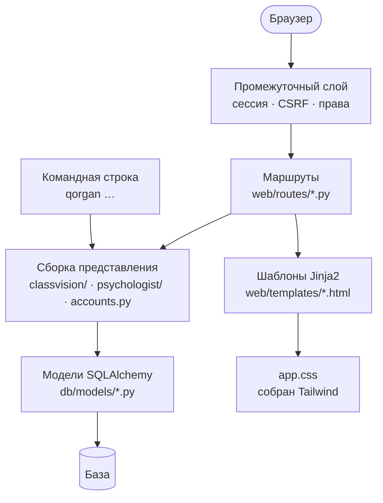
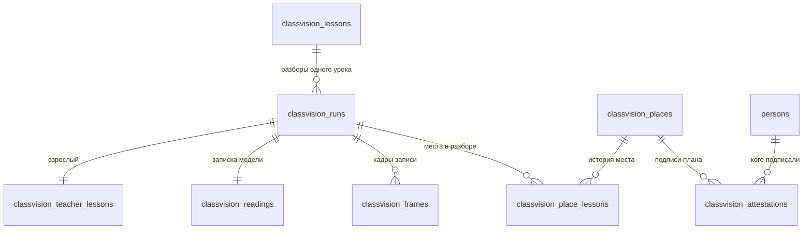
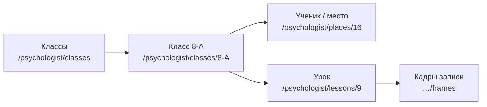
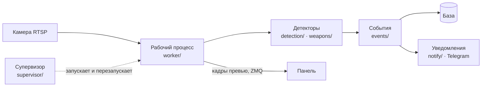

# Платформа `qorgan-ai-main`: слои, права, база

Веб-панель школы плюс командная строка к той же базе. Работает **без видеокарты** и без
единой библиотеки компьютерного зрения — это проверяется тестом и является условием
поставки (см. [`04-decisions.md`](04-decisions.md)).

---

## 1. Слои

**Правило, которое держит всю конструкцию: маршрут не принимает решений.** Его работа —
проверить право и назвать шаблон. Всё, что значит число, живёт слоем ниже, в обычных
функциях Python — потому что правило, живущее в шаблоне, не может быть проверено тестом.

Так же и обратно: **шаблон ничего не вычисляет**. Он не решает, ноль перед ним или
отсутствие измерения — ему передают готовую ячейку, которая уже знает, что она такое.

---

## 2. Права: единственный источник правды

Роль — это **набор прав, а не ранг**. Ни одна роль не «включает» другую.

| Роль | Для кого |
|---|---|
| `operator` | Смотрит и разбирает события |
| `admin` | Настройки, ученики, камеры, учётные записи |
| `developer` | Отладочные страницы, калибровка зон |
| `canteen_staff` | Только журнал столовой, **без** доступа к буллингу |
| `psychologist` | Кабинет, свои заметки, разбор уроков |
| `superadmin` | Только реестр школ. **Никаких данных о детях** |

Права перечислены в `roles.py` — это единственное место, где написано, кто что может.
Примеры: `view_cameras`, `view_bullying`, `view_bullying_media`, `view_canteen`,
`view_pupils`, `view_classroom_analysis`, `view_psychologist_cabinet`,
`write_psychologist_notes`, `manage_users`, `manage_schools`.

**Два правила, которые нельзя нарушать:**

1. **Пункт меню рисуется из того же права, на которое закрыт маршрут.** Два источника
   правды означают ссылку, ведущую в отказ «403», и школу, сообщающую, что система сломана.
2. **Кабинет психолога и разбор уроков — разные права.** Заметки психолога это
   конфиденциальная запись о названном ребёнке, а страницы разбора наблюдают **место** и не
   несут имени, пока школа не подпишет план рассадки. Два разных раскрытия требуют двух
   разных прав, иначе расширение одного молча потянет за собой другое.

Каждое право психолога сверх минимума **раскрыто школе письменно** в
`docs/questions-for-school.md` §10.2, и есть тест, который падает, если роль получила право,
не описанное в документе.

---

## 3. Многоарендность: одна установка — несколько школ

Каждая строка данных принадлежит школе. Проверяется тестом-сторожем
(`tests/tenancy_registry.py` + `test_tenancy_guard.py`), который:

* требует, чтобы **каждая** таблица была отнесена либо к школе, либо к установке;
* требует, чтобы **каждый** запрос к таблице школы называл `school_id`;
* отказ по умолчанию: запрос, о котором никто не подумал, **падает**, а не пропускается.

Таблицы делятся на два вида:

* **корневые** — сами несут `school_id`, потому что никакая другая таблица за них ответить
  не может: `cameras`, `persons`, `users`, `meal_windows`, `classvision_lessons`,
  `classvision_places`;
* **производные** — доходят до школы через ключ, который не может быть пустым: событие
  через камеру, фотография через человека, разбор места через урок.

Список исключений (запросов, которым школу называть не нужно) ведётся вручную, **каждое с
письменным обоснованием**, и отдельный тест следит, чтобы счётчик исключений в комментарии
совпадал с действительностью.

---

## 4. База данных

Alembic, миграции по порядку. На сервере школы — SQLite; PostgreSQL поддерживается тем же
кодом.

### Живой контур

| Таблица | Что хранит |
|---|---|
| `schools` | Реестр школ |
| `users` | Учётные записи панели |
| `cameras` | Камеры |
| `persons` | Ученики и сотрудники: школьный ID, имя, класс |
| `person_photos`, `face_embeddings` | Фотографии и векторы лиц |
| `events`, `notifications` | Инциденты буллинга и их доставка |
| `canteen_sessions`, `meal_windows` | Столовая |
| `lessons`, `lesson_tracks` | Живой разбор урока — **анонимный, по трекам** |
| `psychologist_notes` | Заметки психолога |
| `worker_heartbeats`, `mode_logs` | Состояние рабочих процессов |

> **`lessons` и `lesson_tracks` — единственные две таблицы, которые не ссылаются на
> `persons`, и они не должны получить такую ссылку.** Трек ByteTrack умирает при первом
> длительном перекрытии; `person_id` на нём выглядел бы как основа для четырёхнедельной
> динамики, никогда ею не являясь. Устойчивая единица — место, и под неё сделаны отдельные
> таблицы ниже.

### Разбор уроков (миграция 0010, восемь таблиц)

| Таблица | Смысл |
|---|---|
| `classvision_lessons` | Урок: дата, комната, класс, длительность |
| `classvision_runs` | **Разбор** урока: модель, пороги, разметка комнаты, `run_id` |
| `classvision_places` | Место в комнате: якорь, порядковый номер, роль |
| `classvision_place_lessons` | Место в одном уроке: все счётчики и показатели |
| `classvision_attestations` | Подписанный план рассадки: место → человек, кто подписал |
| `classvision_frames` | Размеченные кадры записи |
| `classvision_readings` | Записка модели и результат проверки |
| `classvision_teacher_lessons` | Поведение взрослого |

**Один урок может иметь несколько разборов.** `run_id` — это отпечаток видео плюс все
настройки, влияющие на числа. Пересчёт с другим порогом даёт **другой** `run_id`, поэтому
повторный импорт идемпотентен, а прошлый месяц нельзя молча переписать измерением, сделанным
по другим правилам. Урок помнит, какой разбор считается основным (`selected_run_id`).

---

## 5. Путь пользователя в кабинете

**Кабинет открывается на классах, а не на ребёнке.** Раньше входом был плоский список
записей, и первым шагом к ребёнку была догадка, за каким местом он сидел.

Внутри класса ученики сгруппированы **по комнатам**, и у каждой комнаты своя строка о
подписи плана. Причина: класс 8-А снимали двумя камерами, «место 1» в одной комнате и «место
1» в другой — **разные стулья с разной историей**, и подписан план только в одной. Слияние
их слило бы двух детей.

---

## 6. Живой контур: рабочие процессы

Процессы **отдельные от панели**: падение детектора не роняет страницу, а модель не грузится
в веб-процесс (правило R3). Кадры превью идут по шине ZMQ **только через loopback** — это
кадры детей в школьном коридоре, и машину они не покидают.

На Railway рабочих процессов нет: там нет ни камер школы, ни видеокарты. Панель показывает
камеры «офлайн», и это честное состояние, а не поломка.

---

## 7. Оформление

Стили пишутся в `src/qorgan/web/tailwind.css` (Tailwind v4: токены в `@theme`, компоненты
через `@apply`) и собираются командой `npm run css` в **закоммиченный** файл
`static/app.css`. На запуске Node не нужен: и панель, и статичная выгрузка кабинета читают
готовый файл.

**Почему компоненты, а не утилиты в разметке.** Половина классов несёт смысл, за который
продукт отвечает: `.cv-unmeasured` это «не измерялось» и не должно выглядеть как ноль,
варианты `.tag` называют состояние строки, `.blank` говорит, что список пуст, а не сломан.
Смысл, записанный набором утилит в девятнадцати шаблонах, разойдётся в двадцатом.

Правила оформления зафиксированы в `classvision/DESIGN.md`.
