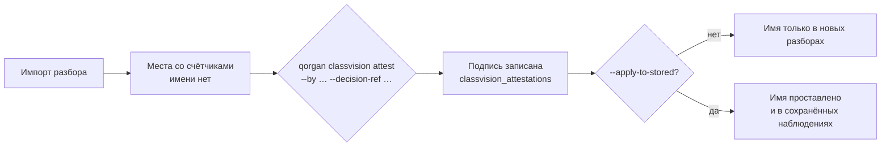

# Контракт между системами

Между анализатором и панелью — **один файл JSON**. Ни общей библиотеки, ни вызова по сети.

```
classvision  ──пишет──▶  <урок>.analysis.json  ──читает──▶  qorgan
 torch, ultralytics,      схема classvision/1.1              fastapi, sqlalchemy
 opencv, insightface                                         НИКОГДА не torch
```

---

## 1. Почему файл, а не библиотека и не HTTP

Три причины, и каждая своя:

1. **Юридическая.** Ultralytics под AGPL-3.0. Панель, вызывающая модель в своём процессе,
   плюс сетевой доступ к панели — это ровно тот случай, на который рассчитана сетевая
   оговорка AGPL. Файл разрывает связь.
2. **Техническая.** Разбор идёт десятки минут на машине с видеокартой; панель отвечает
   школе по локальной сети. Связав их, панель получила бы дерево зависимостей на 2 ГБ и
   режим отказа, при котором долгий прогон модели блокирует загрузку страницы.
3. **Организационная.** Файл можно перенести на флешке. Школе не нужен канал между
   аналитической машиной и сервером.

Проверяется автоматически: `classvision` никогда не импортирует `qorgan`, а `qorgan` никогда
не импортирует `torch`, `ultralytics`, `cv2` или `insightface`.

---

## 2. Что внутри артефакта

| Раздел | Что содержит |
|---|---|
| `schema` | `classvision/1.1` — версия контракта |
| `provenance` | Отпечаток видео, путь, длительность, кадры, модель, пороги, источник времени |
| `room` | Разметка комнаты: зоны доски и стола, перспектива |
| места | По каждому месту: якорь, видимость, счётчики, эпизоды, показатель, разбор по отрезкам урока |
| взрослый | Состояния учителя и доли времени |
| `uncertainty` | Что мешало измерению и насколько |
| `caveats` | Оговорки, которые обязаны доехать до страницы |
| `unmeasured` | Список того, что **не** измерялось, с причиной |

**Разделы `caveats` и `unmeasured` — часть контракта, а не украшение.** Панель обязана их
показать. Именно они превращают «0 выходов к доске» в «не измерялось: зона доски не задана
для этой камеры».

---

## 3. Версия схемы: 1.1 несовместима с 1.0 намеренно

В версии 1.0 одно поле называлось `seconds` и означало **две разные вещи** в двух местах.
Модель, пересказывая такие числа, произвела фразу «сидел 96,5 % (6,0 минуты)» — оба числа
настоящие, утверждение ложное.

В 1.1 поле разделено на `observed_seconds_by_state` (сумма по всем состояниям) и
`episode_seconds` (подмножество), а доли взрослого получили явный знаменатель
(`at_desk_share_of_observed`, `out_of_frame_share_of_lesson`).

**Старые имена удалены, а не оставлены синонимами.** Импортёр, написанный под 1.0, теперь
падает с ошибкой вместо того, чтобы прочитать величину, означающую нечто иное. Импортёр
обязан **отвергать** незнакомую версию схемы, а не приводить её к известной.

---

## 4. Импорт

```bash
qorgan classvision import путь/к/analysis.json
qorgan classvision status
qorgan classvision frames <урок>        # разметка кадров записи
qorgan classvision attest --place 16 --pupil p8a_01 \
    --by "классный руководитель" --decision-ref "план рассадки 8-А" \
    --valid-from 2026-07-07 --apply-to-stored
```

### Идемпотентность и защита от подмены

`run_id` — отпечаток содержимого видео **плюс каждой настройки, способной изменить число**:
веса модели, разрешение, частота выборки, все пороги, разметка комнаты.

Отсюда два свойства сразу:

* повторный импорт того же файла ничего не дублирует;
* пересчёт с другим порогом даёт **другой** `run_id`, поэтому прошлый месяц нельзя молча
  переписать измерением по другим правилам. Ступенька в семестровом ряду, которую никто не
  может объяснить, — это тот отказ, который здесь предотвращается.

### Отказ при пересечении уроков

Типичная операционная ошибка: расписание разобрало папку по файлам, а оператор потом
запустил разбор сессии по той же паре. Оба импорта дали бы **один и тот же час, посчитанный
дважды во всех недельных итогах**.

Импорт это отвергает — в обоих порядках, проверено на реальной паре D14. Переопределение
`--allow-overlap` существует, записывает пометку в строку и печатает её в отчёте: выбор
между «два урока» и «одна сессия» делается **один раз человеком** и не может быть сделан
дважды случайно.

---

## 5. Как имя ребёнка попадает в разбор

Единственным путём — командой `attest`, и она отказывается работать без двух вещей, ни одна
из которых не подставляется по умолчанию:

* `--by` — **кто** подписал (должность или фамилия);
* `--decision-ref` — **на основании чего** (документ школы).



**`--apply-to-stored` выключено по умолчанию.** Имя, проставленное задним числом в
прошлогодние числа, — это изменение сохранённого наблюдения, и оно должно быть **просьбой,
а не побочным эффектом**. Команда печатает, сколько именно строк тронула.

Повторный прогон той же подписи — не конфликт, а ничего не делает. Две разные подписи на
одно место — отказ: это два человека на одном стуле, и разрешить его должен человек.
