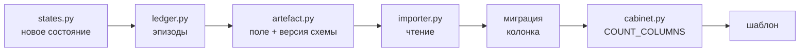

# Как дорабатывать

Практические рецепты. Каждый — с указанием, что именно проверит тест, если сделать неверно.

---

## Добавить страницу

1. **Маршрут** — `src/qorgan/web/routes/`. Только проверка права и имя шаблона.
2. **Сборка данных** — отдельный модуль (`classvision/`, `psychologist/`). Здесь живёт всё,
   что значит число.
3. **Шаблон** — `web/templates/`. Наследует `base.html`, ничего не вычисляет.
4. **Пункт меню** — `base.html`, из **того же права**, на которое закрыт маршрут.
5. **Тест** — обязательно **с данными в базе**.

> Пункт 5 не формальность. Дважды страницы падали на живом сервере при том, что весь набор
> тестов был зелёным: проверки работали на пустой базе, а ошибка находилась за условием
> «если данные есть». Тест, который строит мир и потом смотрит, — единственный, который
> ловит такое.

---

## Добавить право

1. Значение в `Capability` (`roles.py`) с комментарием, какие маршруты им закрыты.
2. Раздать ролям в `ROLE_CAPABILITIES` — **и больше нигде**.
3. Если право получает психолог — **описать его в `docs/questions-for-school.md` §10.2**.
   Тест падает, если роль получила право, не раскрытое школе.
4. Пункт меню — из этого же права.

---

## Добавить счётчик в разбор уроков

Изменение проходит через обе системы:



Два обязательных условия:

* **порог измеряется, а не выдумывается** — и записывается в `MEASUREMENTS.md`;
* **новый счётчик обязан уметь сказать «не измерялось»** — то есть иметь случай, когда
  состояние не может возникнуть, и этот случай должен возвращать не ноль.

При изменении формы артефакта **поднимите версию схемы** и удалите старое имя, а не
оставляйте синонимом.

---

## Изменить оформление

```bash
cd qorgan-ai-main
npm ci
npm run css     # tailwind.css → static/app.css
```

Затем перенести копию в статичную выгрузку кабинета (она вшита в
`classvision/src/classvision/cabinet/skin.py`); тест `test_cabinet_skin.py` падает, если
копия разошлась.

Правила оформления — `classvision/DESIGN.md`. Главные: цвет никогда не несёт смысл в
одиночку (сначала слово), `--alert` принадлежит только оговоркам, и никаких украшений,
намекающих на точность, которой у данных нет.

---

## Загрузить новый разбор

```bash
# на машине с видеокартой
classvision analyse запись.mp4 --config configs/camera_02.yaml

# на сервере панели
qorgan classvision import запись.analysis.json
qorgan classvision frames <урок>
qorgan classvision attest --place N --pupil ID --by "…" --decision-ref "…" \
    --valid-from ГГГГ-ММ-ДД --apply-to-stored
```

---

## Что тестируется автоматически

| Проверка | Что ловит |
|---|---|
| Изоляция школ | Запрос без `school_id` |
| Импорты | `torch`/`cv2` в панели |
| Права | Право у роли, не раскрытое школе |
| Ссылки и флаги | Текст страницы, разошедшийся с настоящим CLI |
| Размер файлов | Файл свыше 500 строк, функция свыше 50 |
| Копия стилей | Расхождение выгрузки с платформой |
| Словарь кабинета | Слова «рекоменд», «риск», «тревожн» |
| Автономность выгрузки | Страница, которая тянет что-то из сети |

Запуск:

```bash
cd qorgan-ai-main && PYTHONPATH=src python -m pytest tests -q
cd classvision   && PYTHONPATH=src python -m pytest tests -q
```

> Три теста детектора оружия падают там, где не установлен `ultralytics` — он в
> необязательной группе зависимостей `ai`. Это ожидаемо на машине без видеокарты.

---

## Чего делать не стоит

* Считать разбор уроков в реальном времени — 0,109 с на кадр, час записи разбирается час.
* Заводить `person_id` на треке — трек не переживает перекрытия.
* Показывать динамику там, где план рассадки не подписан.
* Просить модель пересказывать числа.
* Складывать счётчики разных комнат одного класса.
